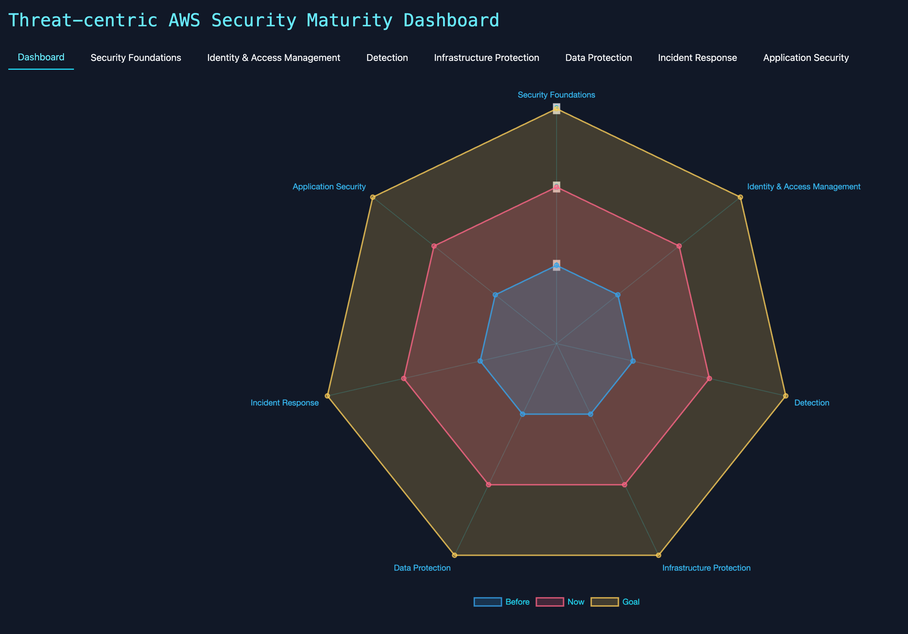
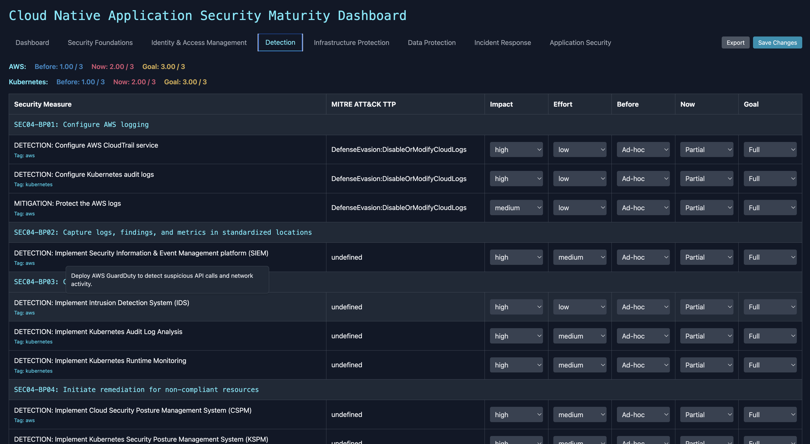
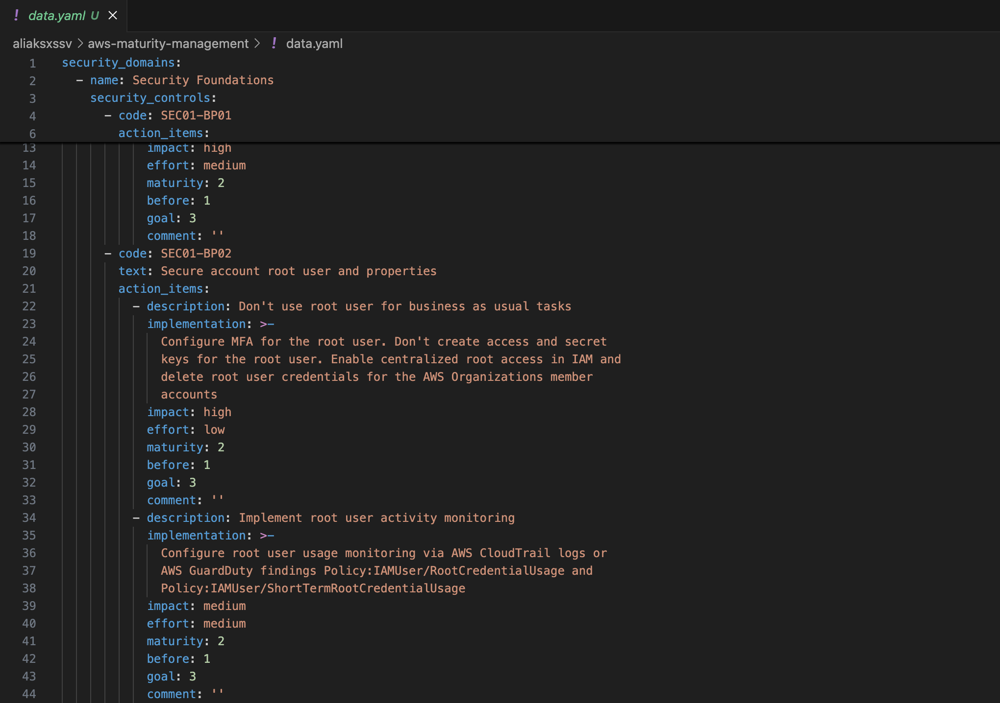

# AWS Security Maturity Dashboard

### Intro

This tool evaluates the maturity of your AWS environment and displays the results in an interactive web-based chart. By grounding decisions in these data-driven insights, you can define a cloud-security roadmap with greater precision.

### Assessment

Assign a weight to each security control by rating both its Impact and Effort. Then, for every control, capture three points on the timeline — its initial maturity, its current maturity, and the target maturity you aim to reach, reflecting the control’s adoption status.

### Adjustment

Modify default security controls according to your vision and requirements. The source data.yml file can be easily adjusted based on your needs.

