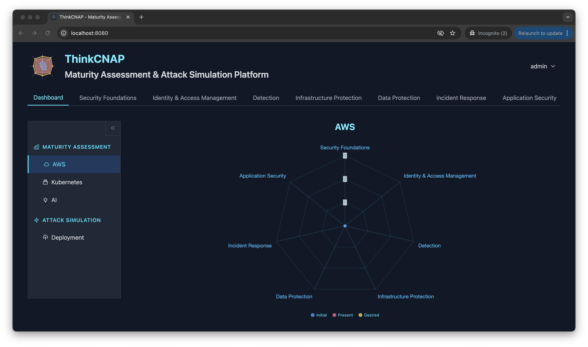

# ThinkCNAP - Helm Chart Deployment

Helm chart for deploying ThinkCNAP application to Kubernetes with PostgreSQL database.

## Prerequisites

- Kubernetes cluster (1.19+)
- Helm 3.0+
- `kubectl` configured
- Persistent volume support

## Installation

### 1. Set Required Values

Create a `my-values.yaml` file with required configuration:

```yaml
# Database password (REQUIRED)
database:
  password: "your-secure-password-here"
  # OR use existing Kubernetes secret (recommended):
  # existingSecret: "think-cnap-db-secret"

# JWT secret for signing auth tokens (REQUIRED)
secrets:
  jwtSecret: "your-strong-jwt-secret"
  # OR use existing Kubernetes secret:
  # existingSecret: "think-cnap-secrets"

# Google OAuth Client ID (optional)
secrets:
  googleClientId: "your-google-client-id.apps.googleusercontent.com"
  # OR use existing Kubernetes secret:
  # existingSecret: "think-cnap-secrets"
```

### 2. Install the Chart

**From Helm repository:**
```bash
helm repo add think-cnap https://aliaksxssv.github.io/think-cnap
helm repo update
helm install my-think-cnap think-cnap/think-cnap \
  --namespace think-cnap \
  --create-namespace \
  -f my-values.yaml
```

### 3. Access the Application

```bash
kubectl port-forward svc/my-think-cnap 8080:80 -n think-cnap
# Open http://localhost:8080
```

## Application Preview



## Default Admin Account

On first database initialization, a default admin user is created:

- Username: `admin@thinkcnap.local`
- Password: `thinkcnap`

Change this after first login.

## Architecture

Single pod with two containers:
- **App Container**: Web application (port 8080)
- **Database Container**: PostgreSQL 16 with automatic migrations and seed data

Shared persistent volume (500Mi default) for database storage.

## Troubleshooting

**Pod Stuck in Pending:**
```bash
kubectl describe pvc -n think-cnap
kubectl get storageclass
```

**Database Not Initialized:**
```bash
kubectl logs <pod-name> -c database -n think-cnap
```

**Application Not Reachable:**
```bash
kubectl get svc -n think-cnap
kubectl port-forward svc/my-think-cnap 8080:80 -n think-cnap
```

**Access Database:**
```bash
POD=$(kubectl get pod -l app.kubernetes.io/name=think-cnap -n think-cnap -o jsonpath='{.items[0].metadata.name}')
kubectl exec -it $POD -c database -n think-cnap -- psql -U thinkcnap -d thinkcnap
```

